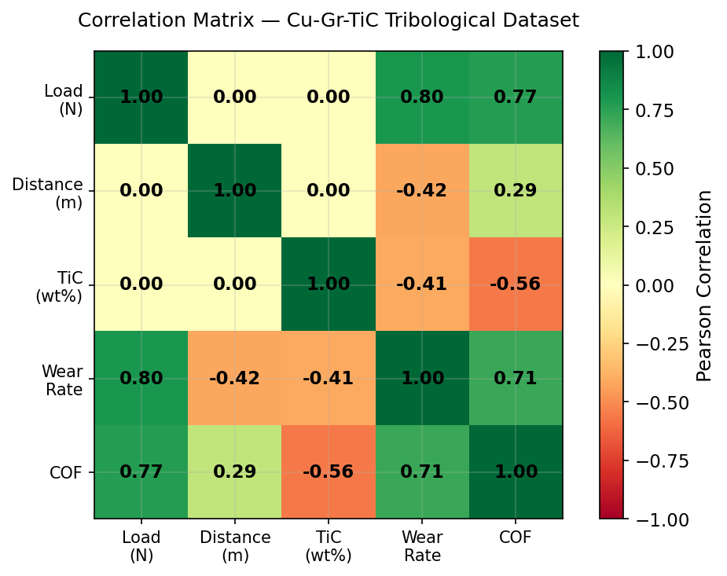
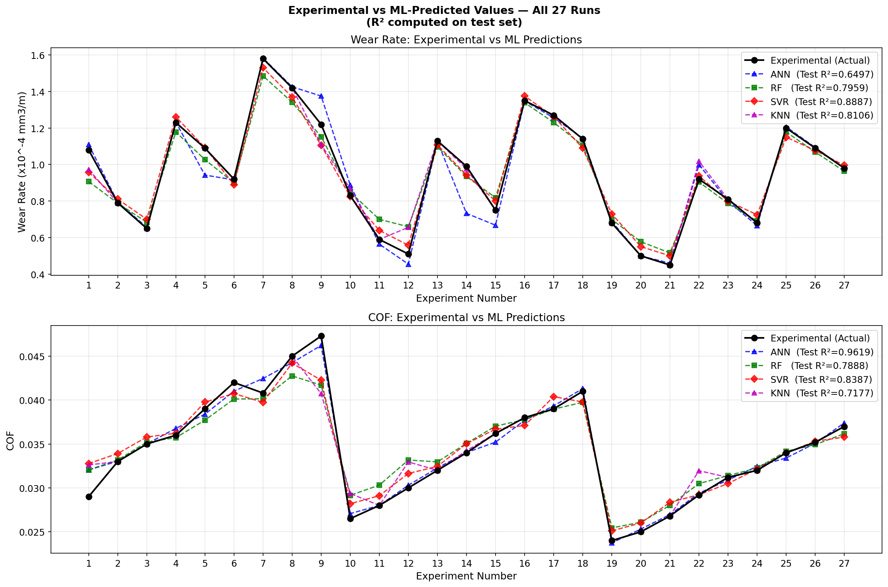
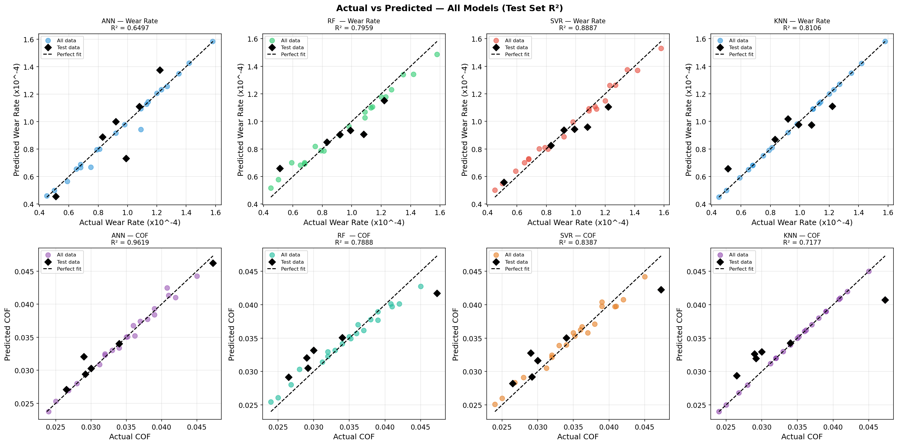

# Prediction and Optimization of Tribological Properties of Copper–Graphite–TiC Composite under Lubricating Sliding Condition using Machine Learning

## Overview

This project focuses on predicting and optimizing the tribological properties of Copper–Graphite–Titanium Carbide (Cu–Gr–TiC) composites under lubricated sliding conditions using Machine Learning techniques.

The study combines experimental tribological data with machine learning models to accurately predict:

* Wear Rate (WR)
* Coefficient of Friction (COF)

This approach reduces the need for costly and time-consuming experimental trials while accelerating material design and optimization.

---

## Problem Statement

Traditional tribological experimentation requires extensive laboratory testing, resources, and time.

The objective of this work is to develop data-driven predictive models capable of estimating wear behavior and friction characteristics of Cu–Gr–TiC composites using process and material parameters.

---

## Dataset Features

### Input Features

| Feature          | Description                          |
| ---------------- | ------------------------------------ |
| Load             | Applied Load (N)                     |
| Sliding Distance | Sliding Distance (m)                 |
| TiC Content      | Titanium Carbide Reinforcement (wt%) |

### Target Variables

| Target                        | Description                            |
| ----------------------------- | -------------------------------------- |
| Wear Rate (WR)                | Material wear during sliding           |
| Coefficient of Friction (COF) | Frictional resistance between surfaces |

---

## Methodology

The complete workflow followed in this project:

1. Data Collection
2. Data Cleaning and Preprocessing
3. Exploratory Data Analysis (EDA)
4. Correlation Analysis
5. Train-Test Split
6. Model Training
7. Hyperparameter Tuning
8. Model Evaluation
9. Prediction and Optimization

---

## Machine Learning Models Used

### Artificial Neural Network (ANN)

* Hidden Layer Architecture: **64-32-16**
* Activation Function: **ReLU**
* Learning Rate: **0.001**
* Optimizer: **Adam**

### Random Forest Regression (RF)

* Ensemble-based regression model
* Robust against noisy data
* Reduces overfitting using multiple decision trees

### Support Vector Regression (SVR)

* RBF Kernel
* Effective for nonlinear prediction problems
* Performs exceptionally well on small datasets

### K-Nearest Neighbors (KNN)

* Distance-based regression algorithm
* Simple and interpretable
* Makes predictions using nearest neighboring samples

---

# Exploratory Data Analysis (EDA)

### Key Observations

* Load showed a strong positive correlation with Wear Rate (**+0.80**).
* Load showed a strong positive correlation with COF (**+0.77**).
* Increasing TiC content reduced Wear Rate.
* TiC reinforcement improved tribological performance.
* Load was identified as the most influential parameter affecting both responses.

---

## Evaluation Metrics

| Metric   | Description                    |
| -------- | ------------------------------ |
| MAE      | Mean Absolute Error            |
| RMSE     | Root Mean Square Error         |
| R² Score | Coefficient of Determination   |
| MAPE     | Mean Absolute Percentage Error |

---

# Results

## Wear Rate Prediction Performance

| Model         | MAE    | RMSE   | R² Score   | MAPE (%) |
| ------------- | ------ | ------ | ---------- | -------- |
| ANN           | 0.1056 | 0.1316 | 0.6497     | 11.31    |
| Random Forest | 0.0799 | 0.1004 | 0.7959     | 10.06    |
| KNN           | 0.0855 | 0.0967 | 0.8106     | 10.70    |
| SVR           | 0.0592 | 0.0742 | **0.8887** | **6.24** |

### Best Wear Rate Model

**Support Vector Regression (SVR)**

* R² Score = **0.8887**
* RMSE = **0.0742**
* MAPE = **6.24%**

---

## Coefficient of Friction (COF) Prediction Performance

| Model         | MAE      | RMSE     | R² Score   | MAPE (%) |
| ------------- | -------- | -------- | ---------- | -------- |
| ANN           | 0.000871 | 0.001349 | **0.9619** | **2.79** |
| Random Forest | 0.002805 | 0.003176 | 0.7888     | 8.41     |
| SVR           | 0.002201 | 0.002776 | 0.8387     | 6.44     |
| KNN           | 0.003169 | 0.003671 | 0.7177     | 9.53     |

### Best COF Model

**Artificial Neural Network (ANN)**

* R² Score = **0.9619**
* RMSE = **0.001349**
* MAPE = **2.79%**

---

# Point-by-Point Prediction Comparison

The figure compares experimental values with machine learning predictions across all 27 experimental runs.

### Wear Rate Prediction

* SVR achieved the highest prediction accuracy with an **R² score of 0.8887**.
* SVR closely followed the experimental trend even at peak and valley regions.
* Random Forest and KNN captured the overall trend but showed larger deviations.
* ANN exhibited the lowest Wear Rate prediction accuracy.

### COF Prediction

* ANN achieved the highest prediction accuracy with an **R² score of 0.9619**.
* Predicted values closely matched the experimental values across all runs.
* RF and SVR performed reasonably well.
* KNN showed larger deviations at extreme values.

---

# Actual vs Predicted Analysis

The scatter plots compare actual experimental values against model predictions.

### Key Insights

* SVR produced the tightest clustering around the ideal diagonal line for Wear Rate prediction.
* ANN showed near-perfect alignment for COF prediction.
* Test-set performance remained consistent with the complete dataset.
* No significant overfitting was observed.
* The models demonstrated strong generalization capability on unseen experimental conditions.

---

## Key Findings

* SVR achieved the highest Wear Rate prediction accuracy among all models.
* ANN achieved the highest COF prediction accuracy.
* Machine Learning effectively captured the complex nonlinear tribological behavior of Cu–Gr–TiC composites.
* ML-based prediction can significantly reduce the number of experimental trials required.
* Increasing TiC reinforcement improved wear resistance and frictional performance.
* Load was found to be the dominant factor affecting both Wear Rate and COF.

---

## Technologies Used

| Technology       | Purpose                 |
| ---------------- | ----------------------- |
| Python           | Programming Language    |
| Pandas           | Data Manipulation       |
| NumPy            | Numerical Computing     |
| Matplotlib       | Data Visualization      |
| Scikit-Learn     | Machine Learning Models |
| Jupyter Notebook | Development Environment |

---

## Conclusion

This study successfully developed machine learning models to predict the tribological properties of Cu–Gr–TiC composites under lubricated sliding conditions.

Among the evaluated models, **Support Vector Regression (SVR)** achieved the best Wear Rate prediction performance with an **R² score of 0.8887** and **MAPE of 6.24%**, outperforming Random Forest, KNN, and ANN models.

For Coefficient of Friction prediction, the **Artificial Neural Network (ANN)** demonstrated the highest accuracy with an **R² score of 0.9619** and **MAPE of 2.79%**.

The optimization analysis further revealed that the minimum Wear Rate and COF were achieved at:

* Load = 30 N
* Sliding Distance = 8000 m
* TiC Content = 4.5 wt.%

These findings are consistent with the physical understanding that TiC reinforcement improves wear resistance while graphite contributes to self-lubrication.

The developed framework provides a reliable and cost-effective approach for tribological property prediction, material optimization, and accelerated composite design.

---

## References

1. Ankit et al. (2023) – Prediction of Tribological Performance of Cu–Gr–TiC Composites Based on Response Surface Methodology and Worn Surface Analysis.

2. Huifeng Ning et al. (2023) – Modeling and Prediction of Tribological Properties of Copper/Aluminum–Graphite Self-Lubricating Composites using Machine Learning Algorithms.

3. Ankit et al. (2023) – Synergetic Influence of TiC and Graphite Particles on Tribological Performance of Cu-Based Composites Prepared by Flake Powder Metallurgy.

4. Siddeshkumar et al. (2025) – Machine Learning Models for Wear Rate Prediction of Nano Hybrid MMCs.

---

## Authors

**Manas Srivastava**

Department of Mechanical Engineering,

Kamla Nehru Institute of Technology (KNIT), Sultanpur, Uttar Pradesh, India

